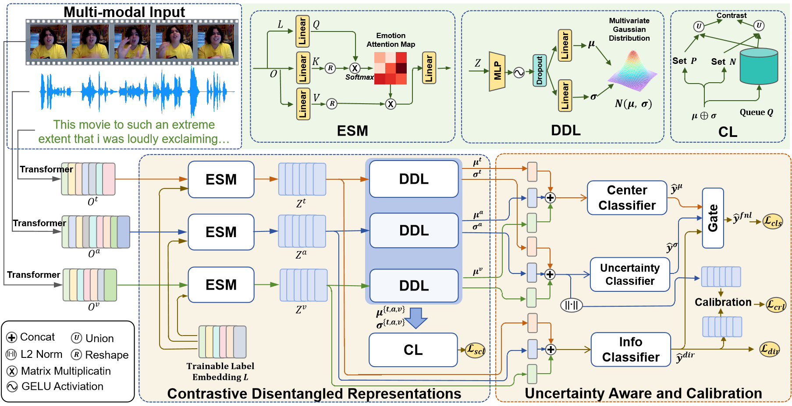
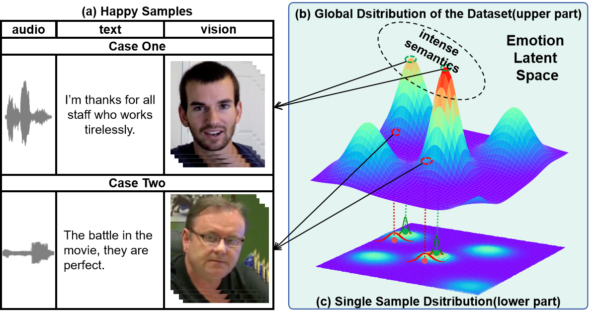

# Latent Distribution Decouple for Uncertain-Aware Multimodal Multi-label Emotion Recognition(LDDU)

## 1. framework


*The proposed framework consists of three components: (1) the transformer-base unimodal extractor (2) a contrastive learning-based emotion space decomposition module and (3) an uncertainty-aware fusion and uncertainty calibration module.*

## 2. An illustration of aleatoric uncertainty


*An illustration of aleatoric uncertainty in MMER task. When adopting Gaussian distribution modeling in latent emotion space, case two’s semantic feature is more fuzzed with a larger variance due to cold speaking style than case one. Meanwhile, case one has stronger emotion intense located closer to the center of global distribution.*

## 3. Data
the dataset can be downloaded from [here](https://drive.google.com/drive/folders/1umLIjIlL8Y1oWYzU2L6UyPTHFQx7RREB). Please download the aligned data and unaligned data to "./dataset/dataset1/". Then run the script:
```bash
cd ./dataset
python data_process.py
```

the dataset is without labels, to get ground truth, you can process by yourself, or use processed groud truth file from "./dataset/dataset1/label.csv"


More details about CMU-MOSEI and M3ED datasets will be released soon after the paper is officially published.
## 4. Train and inference
```bash
pip install -r requirement
sh trian.sh
```